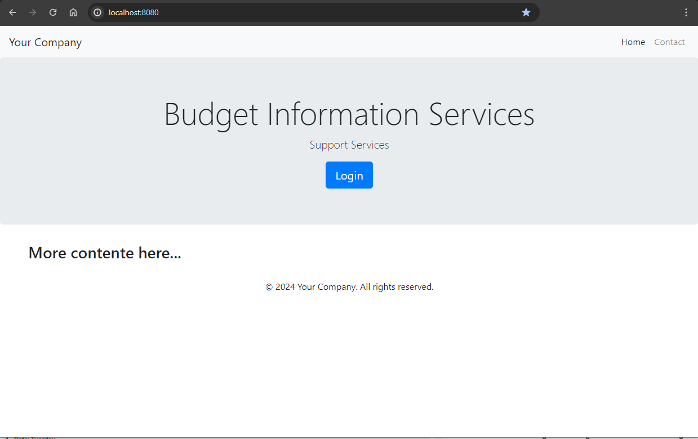

# Spring-Boot-Simple-Login
A simple Spring-Boot application that shows a homepage with a login option to a dashboard page.
This was built with Spring Boot v.3.2.5 and Spring Security v.6.0
The pom.xml file has the minimum packages required to run a simple Spring Boot application with user authentication (login page).

The html web pages include the Thymeleaf library to further manipulate data sent to the user:     
`<html lang="en" xmlns:th="http://www.thymeleaf.org">`

The css formatting is done with Bootstrap:     
`<link rel="stylesheet" href="css/bootstrap.min.css">`

Javascript and CSS libraries are not downloaded from the internet, they reside under `main/resources/static`

This small application has a `CustomAuthenticatorProvider` that loads the list of usernames and thier passwords from 'users.txt'. In theory a different authenticator (LDAP, OAuth, etc.) could replace it to modify to your environment.

Given the size of this application, all controller classes could be goruped into one if the application is not expected to grow much more.

